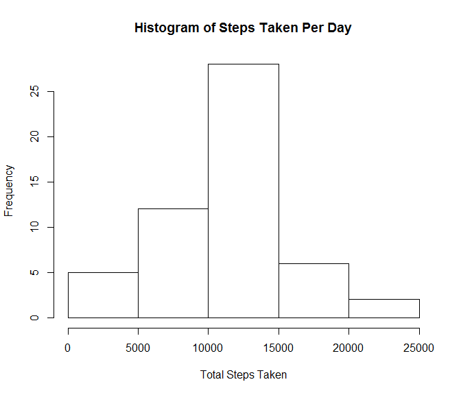
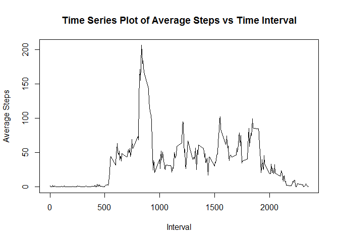
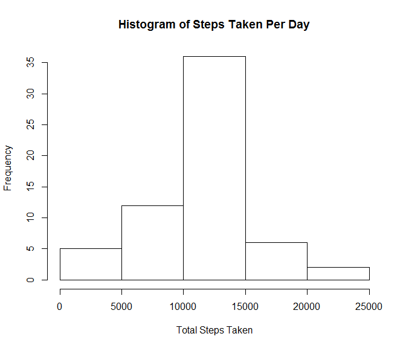
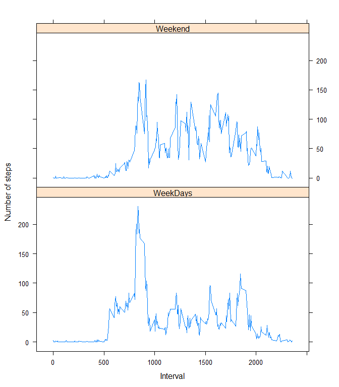

# Reproducible Research: Peer Assessment 1


## Loading and preprocessing the data
This code below are used for preprocessing the data:


```r
activityData<-read.csv(unzip("activity.zip"))
activityDataWithoutNA<-activityData[!is.na(activityData$steps),]
```


## What is mean total number of steps taken per day?
Calculation for the number of steps taken per day

```r
options(scipen=999)
aggSteps<-aggregate(activityDataWithoutNA$steps,by=list(Date=activityDataWithoutNA$date),sum)
colnames(aggSteps)<-c("Date","Total Steps")
```

### Histogram of steps taken per day


```r
totalSteps<-aggSteps$`Total Steps`
hist(totalSteps,xlab = "Total Steps Taken",main="Histogram of Steps Taken Per Day")
```

 

The median for total steps taken per day is : **10765**  

The mean for total steps taken per day is : **10766.1886792**

## What is the average daily activity pattern?


```r
avgInterval<-aggregate(activityDataWithoutNA$steps,by=list(activityDataWithoutNA$interval),mean)

colnames(avgInterval)<-c("Interval","Average")

maxMean<-avgInterval[avgInterval$Average==max(avgInterval$Average),]

plot(avgInterval$Interval,avgInterval$Average,type = "l",xlab = "Interval",ylab = "Average Steps",main = "Time Series Plot of Average Steps vs Time Interval")
```

 


The biggest mean of steps taken is in interval : **835**


## Imputing missing values  

###Calculating the number of NA in dataset 


```r
countNA<-nrow(activityData[is.na(activityData$steps),])
```
The number of rows with missing data are : **2304**  

###Imputting NA with mean of that interval
The missing data will be replaced with the mean of the steps in that interval (5 minute interval)  


```r
activityDataImputted<-data.frame(x=character(0),y=character(0),z=numeric(0),stringsAsFactors = FALSE)

count1<-1

lengthActivityData<-nrow(activityData)

while(count1<=lengthActivityData)  {
  data1<-activityData[count1,]
  
  
  if(is.na(data1$steps))  {
    meanInterval<-avgInterval[avgInterval$Interval==data1$interval,2]
    
    activityDataImputted[count1,]<-c(meanInterval,as.character(data1$date),data1$interval)
  }
  else  {
    activityDataImputted[count1,]<-c(data1$steps,as.character(data1$date),data1$interval)
  }
  count1<-count1+1 
}
colnames(activityDataImputted)<-colnames(activityData)
```


###New Histogram

```r
aggSteps<-aggregate(as.numeric(activityDataImputted$steps),by=list(Date=activityDataImputted$date),sum)

colnames(aggSteps)<-c("Date","Total Steps")
totalSteps2<-aggSteps$`Total Steps`
hist(totalSteps2,xlab = "Total Steps Taken",main="Histogram of Steps Taken Per Day")
```

 

The median for total steps taken per day is : **10766.1886792**  

The mean for total steps taken per day is : **10766.1886792**

*We can see here that the mean value is the same with the original dataset, but the median is differ*

## Are there differences in activity patterns between weekdays and weekends?


```r
# Create new dataset with weekdays flag

count1<-1

lengthActivityData<-nrow(activityDataImputted)


activityDataWeekDays<-data.frame(x=numeric(0),y=character(0),z=numeric(0),a=character(0),check.names = FALSE,stringsAsFactors = FALSE)


while(count1<=lengthActivityData)  {
  data1<-activityDataImputted[count1,]
  
  
  date1<-as.Date(data1$date,origin="1970-01-01")
  
  
  dayName<-weekdays(date1)
  
  
  if(dayName=="Saturday"|dayName=="Sunday")  {
    weekFlag<-"Weekend"
    
  }
  else  {
    weekFlag<-"WeekDays"
  }
  
  activityDataWeekDays[count1,]<-c(data1$steps,as.character(data1$date),data1$interval,weekFlag)  
  count1<-count1+1
}
colnames(activityDataWeekDays)<-c("steps","date","interval","weekflag")


# Separate the dataset between mean for weekend and mean for weekdays
meanIntervalWeek<-aggregate(as.numeric(activityDataWeekDays$steps),by=list(activityDataWeekDays$interval,activityDataWeekDays$weekflag),mean)
colnames(meanIntervalWeek)<-c("interval","weekflag","steps")
meanIntervalWeek<-meanIntervalWeek[order(as.numeric(meanIntervalWeek$interval)),]
rm(activityDataWeekDays)


#Create the plot

library("lattice")
xyplot(as.numeric(steps) ~ as.numeric(interval)| weekflag, 
           data = meanIntervalWeek,
           type = "l",
           xlab = "Interval",
           ylab = "Number of steps",
           layout=c(1,2))
```

 
